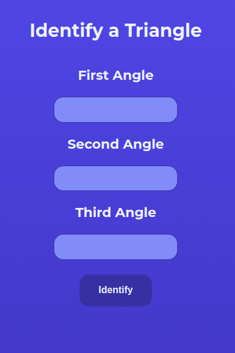

# Fun With Triangles

## Made Using HTML, CSS and JavaScript

This website is divided into 4 parts -> Quiz, Triangle Identifier, Hypotenuse Calculator and Area Calculator.

### Navigation:

The website has a very simple navigation bar. You just need to click on the tab you wish to navigate to and it will take you there!

- **Navigation Bar**

***
### Triangle Quiz:

The quiz is based on triangles. There are a total of 10 questions, for each correct answer you gain a point. There is no negative marking. 

Every question has multiple choices for answers, only one is correct. You can click on the **radio button** infront of the option you think is the answer to select it and continue to the next question.

- **Quiz**

At the end of the quiz, there is a **submit button**. Click on it to submit your answers. Your final score will get displayed below the submit button.

- **Submit Button**

***
### Identify Triangle:

The triangle identifier has three input fields. In each field, you can input an angle and then click on the **identify button**. 

- **Identifier's Interface**

The identifier will check whether the three angles add up to a sum of 180, as angles of any triangle adds up to a sum of 180. After checking, it will display the result under the identify button. Any errors will get displayed there as well.

- **Identifier's Working**

***
### Hypotenuse:

The hypotenuse calculator has two input fields, **base** and **height**. You have to input the base and height of the triangle you want to calculate the hypotenuse of. Click **Claculate Hypotenuse** to calculate it.

- **Calculator's Interface**

The output will get displayed below the calculate hypotenuse button. Any errors will get displayed there too.

- **Calculator's Working**

***
### Area Of Triangle:

The Area of Triangle calculator has three input fields. **Each field takes a side of the triangle** of which you want to calculate the area. The calculator uses Heron's Formula to calculate the area. Click **Calculate Area** to calculate the area.

- **Calculator's Interface**

The output will get displayed below the calculate area button. Any errors will get displayed there as well.

- **Calculator's Working**

***
#### Enjoy Playing With The Triangles!
